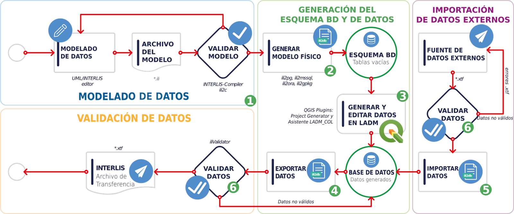
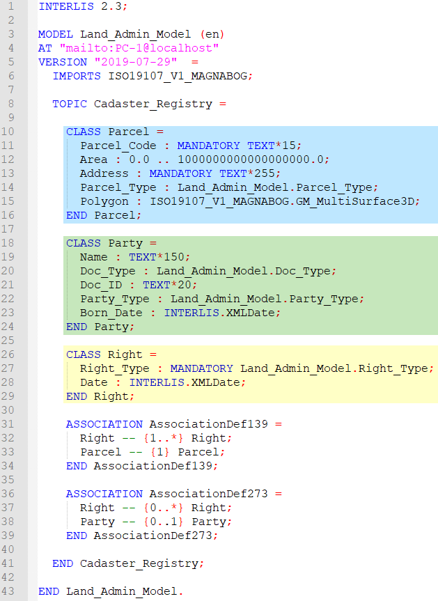
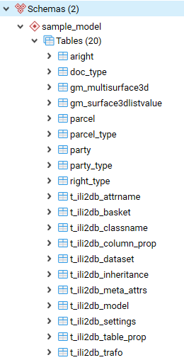

# Flujo de implementación con Interlis

En la Figura de abajo se presenta un enfoque para la implementación de Interlis propuesto por la Agencia de Implementación en el marco del proyecto Modernización de la Administración de Tierras en Colombia, que incluye los siguientes pasos:

1. Modelado de datos
2. Generar modelo físico
3. Generar y Editar datos
4. Exportar Datos
5. Importar Datos
6. Validar Datos (Paso transversal al flujo)

## Modelado de Datos

El primer paso al usar Interlis es el **Modelado de Datos** con el lenguaje de Interlis. Este paso es el más importante, debido a que el modelado de datos con Interlis no solo nos permite describir los modelos que abstraen la realidad que se requiere representar, sino que define una semántica común entre los sistemas de información que van a cooperar y además especifica implícitamente la estructura del formato de transferencia de Interlis.

Como ejemplo de modelado de datos, en la Figura 4 se observa el código de un modelo denominado Land_Admin_Model en el lenguaje de Interlis. Este código se puede escribir en cualquier editor de texto. Lo importante es que cumpla con la sintaxis de Interlis y esto se logra examinando el archivo fuente con un compilador de Interlis como **ili2c**[^enlace_ili2c].

------

[^enlace_ili2c]: https://www.interlis.ch/en/downloads/ili2c

Otra estrategia que se puede utilizar es, no escribir el código directamente, sino construir el modelo como un Diagrama de clases de UML y exportarlo a código Interlis con una herramienta llamada UML/Interlis Editor. Esta herramienta e ili2c son explicadas más adelante en este mismo documento.

## Generar un modelo físico

Interlis tiene como uno de sus enfoques ser independiente al software sobre el que se implementa el modelo, esto bajo el principio de neutralidad tecnológica. Pero en la práctica, los datos de los sistemas de información se guardan en bases de datos de un motor específico y al momento de pasar de un modelo descriptivo a un modelo de aplicación, es necesario optar por una solución de software en particular. La virtud de Interlis en este sentido, es que cuenta con una serie de herramientas que permite pasar del modelo descriptivo a diferentes motores de bases de datos. En el presente enfoque se **Genera un modelo físico** (esquema de base de datos) en el motor de base de datos que requiere el sistema y que es compatible 100% con Interlis.

Interlis es independiente de plataformas. Sin embargo, existen herramientas de software como ili2db que permiten transformar un modelo descrito en Intelis a esquemas de base de datos compatibles. Estas herramientas traducen las clases, relaciones y tipos de datos a sus equivalentes en el motor de base de datos de destino. En la Figura 5 y Figura 6 están las bases de datos generadas en Postgres y MsSQL Server respectivamente, para el modelo de ejemplo de la Figura 4.

## Generar y Editar Datos

En esta fase, la **gestión de datos es una de las actividades más recurrentes en el proceso, tanto la generación como la edición de información** hacen parte de las tareas más comunes en un sistema de información. Los datos pueden ser ingresados por aplicaciones propias del sistema o de manera masiva según sea el caso. La agencia ha desarrollado algunas herramientas que facilitan este proceso para los sistemas Geográficos y que serán descritas más adelante.

## Exportar Datos

Cuando el sistema requiere compartir datos con otro sistema, la AI propone realizarlo usando Interlis, y para ello se deben generar los archivos **XTF** de la información contenida en la base de datos del sistema. Compartir la información con el formato de transferencia de Interlis hace que esta no esté acoplada a un sistema de base de datos en particular. En el enfoque propuesto, las herramientas utilizadas para crear la base de datos en el paso **Generar un modelo físico** como ili2db, iliSuite, ModelBaker o Asistente LADM-COL, también permiten **Exportar Datos** de ésta a archivos de transferencia de Interlis (XTF).

## Importar Datos

Como el objetivo que se busca al usar Interlis es permitir el intercambio de datos entre sistemas, también se recibe información de sistemas externos en formato XTF. Esta información se puede importar en la base de datos del sistema usando las herramientas mencionadas en los pasos Generar un modelo físico y Exportar Datos.

Es importante mencionar que, al importar los datos, las herramientas sugeridas hacen una validación previa de los datos respecto a los modelos y de esta manera, garantizan que la información que ingresa a la base de datos de nuestro sistema es conforme a los modelos con que se está trabajando.

## Validar Datos

Siempre que se requiera, y en particular cuando se importan y exportan datos al sistema, se pueden **Validar los Datos** con herramientas de software que inspeccionan si los archivos de transferencia cumplen con los modelos descritos en el lenguaje de Interlis. Estas validaciones no solo verifican la estructura de los datos sino también la cardinalidad, los valores de dominios y demás restricciones especificados en los modelos.La AI sugiere la utilización de un conjunto de herramientas que sirven para la validación de los datos y que serán explicadas en las siguientes secciones. La herramienta principal es **ilivalidator**.