# Herramientas Interlis

Cada uno de los pasos descritos anteriormente se lleva a cabo con el apoyo de alguna herramienta de software. El conjunto de dichas herramientas es lo que se ha denominado en el presente documento como **Herramientas Interlis** y serán descritas en el resto de esta sección.

Estas herramientas las podemos agrupar en herramientas **primarias** cuyo objetivo es la interacción con bases de datos, validación de datos o validación de modelos, y herramientas **extendidas**, que hacen uso de las primarias y extienden su funcionalidad.

Entre las herramientas **primarias**, encontramos:

1. ili2c – Compilador del lenguaje Interlis
2. UML/Interlis Editor – Editor de diagramas UML que exporta a lenguaje Interlis
3. ili2db – Conjunto de herramientas que permite: crear bases de datos a partir de modelos de Interlis e importar/exportar datos a una base de datos a partir de archivos de transferencia
4. ilivalidator – Permite validar archivos de transferencia contra sus modelos correspondientes

Entre las herramientas **extendidas**:

1. iliSuite – Herramienta de escritorio que presenta una interfaz más amigable con el usuario y facilita el uso de algunas de las herramientas **primarias**
2. Model Baker – Plugin de QGIS que permite generar/editar datos de los modelos de Interlis y hace uso de la herramienta ili2db para la creación de las bases de datos e importación/exportación de datos desde un archivo de transferencia
3. Asistente LADM – Plugin de QGIS que permite gestionar la información del modelo LADM_COL

A continuación se presenta el diagrama de componentes de las herramientas Interlis:

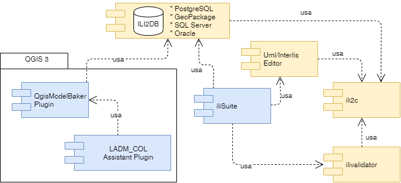

| Herramienta                     | Enlaces                                                      | Licencia | Lenguaje | Tipo   Aplicación    | Participación SwissTierras             |
| ------------------------------- | ------------------------------------------------------------ | -------- | -------- | -------------------- | -------------------------------------- |
| ili2c                           | [Binarios](https://github.com/claeis/ilivalidator/releases) [Cód. Fuente](https://github.com/claeis/ilivalidator) | LGPL 2   | Java     | consola   escritorio |                                        |
| Uml/Interlis Editor             | [Binarios fork principal](https://www.interlis.ch/downloads/umleditor)  [Binarios SwissTierras](https://github.com/SwissTierrasColombia/umleditor/releases)   [Cód. Fuente fork principal](https://github.com/claeis/umleditor) [Código fuente SwissTierras](https://github.com/SwissTierrasColombia/umleditor) |          | Java     | escritorio           | Versión propia con mejoras             |
| Conjunto de herramientas ili2db | [Binarios](http://www.eisenhutinformatik.ch/interlis/) [Binarios SwissTierras](https://github.com/SwissTierrasColombia/ili2db/releases)  [Cód. Fuente](https://github.com/claeis/ili2db) [Código fuente SwissTierras](https://github.com/SwissTierrasColombia/ili2db) | LGPL     | Java     | consola              | Ver {ref}`tabla de ili2db<ili2db_table>` |
| ilivalidator                    | [Binarios](https://github.com/claeis/ilivalidator/releases)  [Cód. Fuente](https://github.com/claeis/ilivalidator) | LGPL 3   | Java     | consola   escritorio |                                        |
| iliSuite                        | [Binarios](https://github.com/SwissTierrasColombia/iliSuite/releases)  [Cód. Fuente](https://github.com/SwissTierrasColombia/iliSuite) | LGPL     | Java     | escritorio           | Creada por SwissTierras                |
| ModelBaker                      | [Cód. Fuente](https://github.com/opengisch/QgisModelBaker)   |          | Python   | plugin               | Participación en mejoras al proyecto   |
| Asistente LADM_COL              | [Cód. Fuente](https://github.com/SwissTierrasColombia/Asistente-LADM_COL) | GPL 3    | Python   | plugin               | Creada por SwissTierras                |

## ili2c

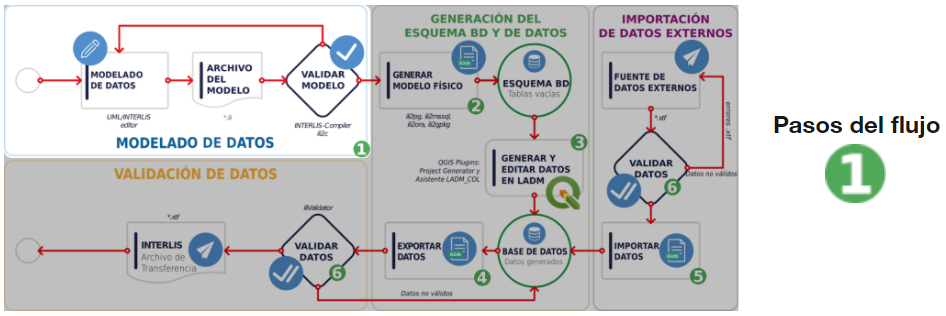

Es una aplicación que verifica si la sintaxis de uno o varios archivos de código fuente de Interlis es correcta. Se puede ejecutar a través de la línea de comandos o con su propia interfaz gráfica. También permite generar el XSD asociado al formato de transferencia a partir de los modelos de Interlis.

*ili2c desde consola:*

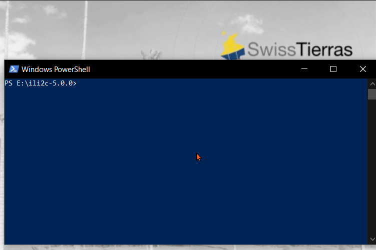

*ili2c desde la interfaz gráfica:*

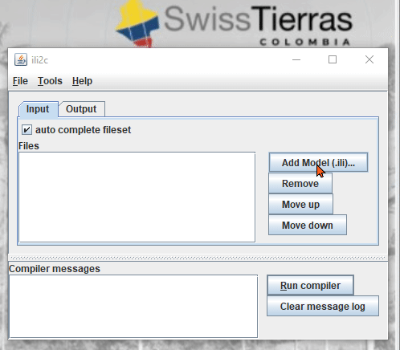

## UML/Interlis Editor

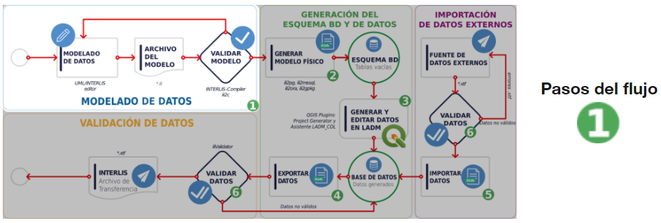

Es un editor de diagramas de clases de UML que tiene como característica principal la posibilidad de exportar un modelo UML a archivos de modelo de Interlis. Permite definir propiedades, dominios, restricciones y otras características propias de Interlis que no están en un diagrama de clases común.

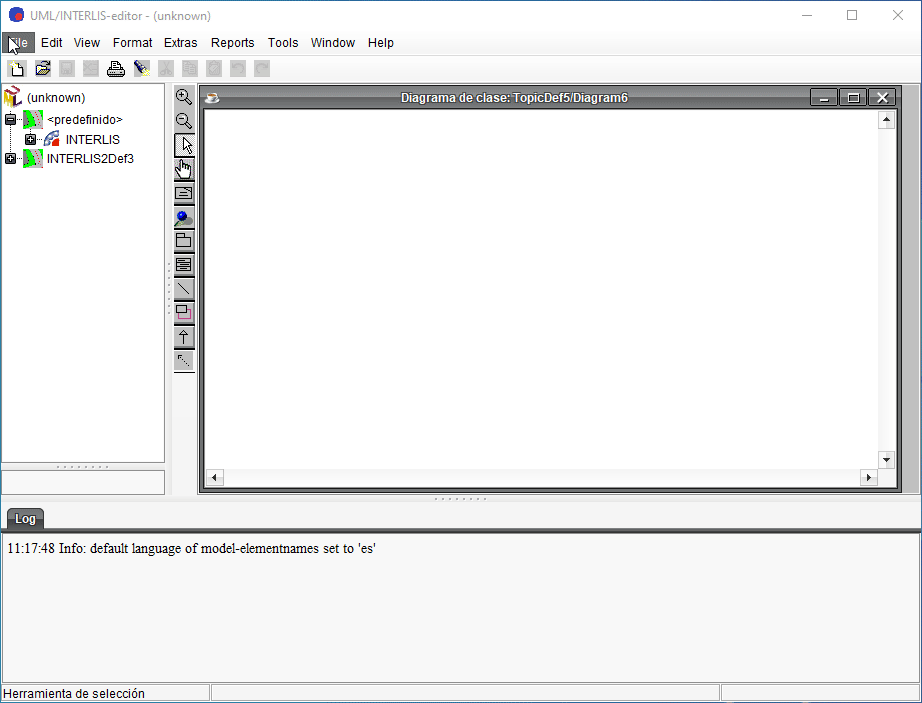

SwissTierras tiene un fork del proyecto principal en donde se han realizado algunas mejoras a la aplicación.

## ili2db

Es un conjunto de herramientas de consola para trabajar con Interlis. Cada una de estas herramientas realiza 3 funciones principales:

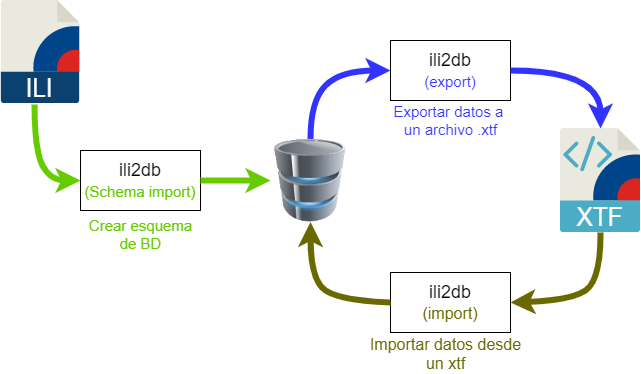

1. **Crear un esquema de base de datos** a partir de uno o varios modelos descritos en el lenguaje de modelado de Interlis (archivos ili).
2. **Exportar datos** desde una base de datos a un archivo de transferencia de Interlis (xtf).
3. **Importar datos** desde un archivo de transferencia de Interlis (xtf) a una base de datos.

El nombre de cada aplicación sigue la convención **ili** **2** **[Sigla de un motor de base de datos]** que significa **Interlis** **To** **DB de destino**. Por ejemplo, si se requiere trabajar con el motor **Postgres**, la aplicación que debemos utilizar es **ili2pg** como se especifica en la siguiente tabla.

| **Interlis** **To** **DB de destino** | **Descripción**                            |
| ------------------------------------- | ------------------------------------------ |
| **ili**2**pg**                        | **Interlis** **a** **Postgres**            |
| **ili**2**ora**                       | **Interlis** **a** **Oracle**              |
| **ili**2**mssql**                     | **Interlis** **a** **Microsoft SQLServer** |

En la Tabla siguiente se listan las aplicaciones que existen actualmente con las correspondientes bases de datos que gestionan y el nivel de participación de SwissTierras Colombia en el desarrollo de éstas.

(ili2db_table)=
| **Herramienta** | **Base de datos**              | **Participación de SwissTierras Colombia**            |
| --------------- | ------------------------------ | ----------------------------------------------------- |
| ili2pg          | Postgres con extensión Postgis | Revisión de la aplicación y corrección de  errores    |
| ili2gpkg        | GeoPackage                     | Revisión de la aplicación y corrección de  errores    |
| ili2mssql       | Ms SQL Server 2012 o superior  | Creación de la herramienta y corrección de errores    |
| ili2ora         | Oracle 11 o superior           | Actualizado a Oracle Spatial y corrección de  errores |
| ili2fgdb        | File Geodatabase               | No participa.                                         |
| ili2gdb         | GeoDb                          | No participa.                                         |
| ili2mdb         | Microsoft Access Database      | No participa.                                         |
| ili2mysql       | My SQL                         | No participa.                                         |

SwissTierras Colombia, en su fork del proyecto principal, ha venido trabajando en crear, mejorar y/o dar soporte a varias de las herramientas. Dichos cambios, en su mayoría, han sido integrados al proyecto principal.

## ilivalidator

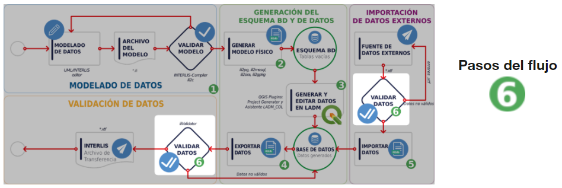

Es una aplicación que verifica si los datos de un archivo de transferencia de Interlis están conformes con sus respectivos modelos de Interlis. Puede ser ejecutado en consola o con interfaz gráfica.

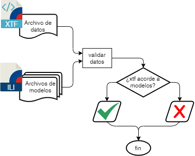

El usuario le proporciona principalmente a ilivalidator dos cosas: la primera es el archivo xtf con los datos a verificar, y la segunda, el archivo ili o los repositorios donde se encuentran los archivos ili con los modelos. Con esta información, ilivalidator no solo revisa que los datos tengan la estructura adecuada, sino que revisa que cumplan con las definiciones adicionales que contienen los modelos, como la cardinalidad de los campos; cardinalidad entre registros; restricciones de los datos y valores de dominios adecuados.

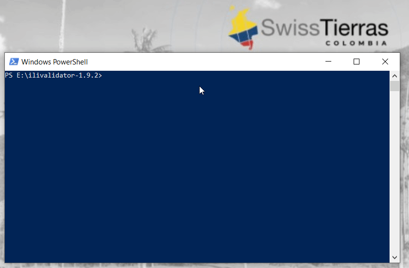

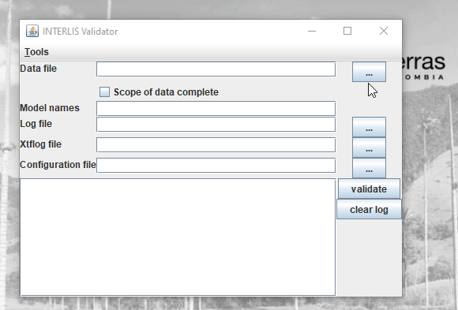

## iliSuite

Es una aplicación creada por SwissTierras cuyo objetivo es facilitar el trabajo con Interlis al integrar las herramientas mencionadas anteriormente, en una interfaz gráfica simple tipo Wizard que guía al usuario en cada proceso. La intención de iliSuite es tener en una sola aplicación las herramientas que se requieren en el flujo de implementación de Interlis. Además, por ser una aplicación Java es multiplataforma y, por lo tanto, puede ser ejecutada en Windows y sistemas compatibles con GNU/Linux. 

IliSuite se encuentra en una etapa estable de desarrollo y SwissTierras continuamente está agregando mejoras y actualizando la aplicación para agregarle las nuevas características que se le agregan a las herramientas que contiene.

Como el objetivo de SwissTierras es facilitar el trabajo con Interlis, ha desarrollado un instalador de iliSuite para los sistemas operativos Windows.

*Ejemplo de creación de base de datos a partir del modelo Interlis:*

*Capas de Ilisuite:*

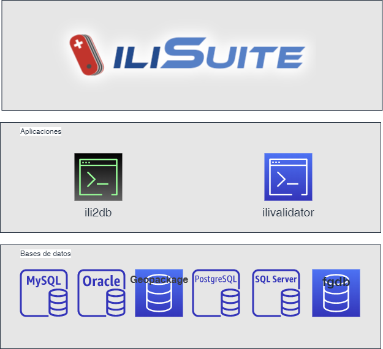

## ModelBaker

Es un plugin para QGIS 3 que permite crear esquemas de BD y provee las capas y formularios de edición con base en el esquema. Exporta datos estructurados en el formato INTERLIS (XTF).

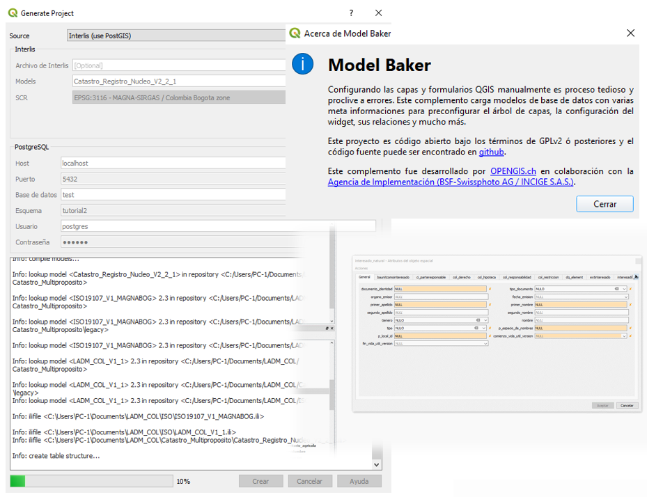

## Asistente LADM-COL

Es un plugin para QGIS 3 que permite gestionar la información del modelo **LADM_COL**. Asiste en el flujo para capturar y editar datos conformes con el modelo catastro-registro de LADM_COL; realizar validaciones sobre los datos generados; y generar archivos de intercambio de INTERLIS (.XTF). Para más información, consulte la [documentación](https://swisstierrascolombia.github.io/Asistente-LADM-COL/introduccion.html#generalidades) o el [repositorio de código](https://github.com/SwissTierrasColombia/Asistente-LADM-COL) del Asistente LADM-COL

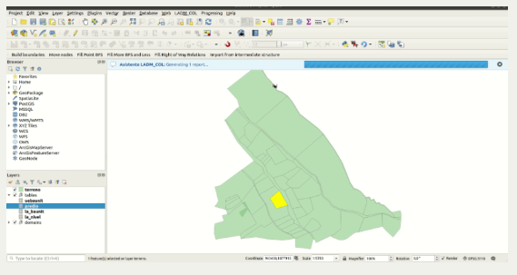

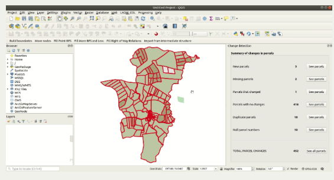

