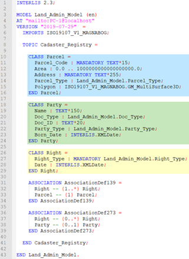
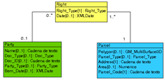
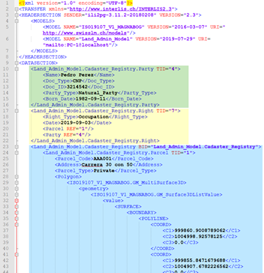

# Interlis

Interlis (de **Inter**: entre y **LIS**: Land Information System) [^def_nombre]) es un estándar (SN612031) que busca la interoperabilidad entre Sistemas de Información, en particular, Sistemas de Información Geográfico. Interlis tiene dos alcances bien diferenciados:

1. La descripción conceptual o descripción de modelos a través de un lenguaje para este fin

2. El intercambio de datos, a partir de la definición de un formato de transferencia unificado, derivado de los modelos descritos por el lenguaje

Un aspecto importante de Interlis es que es neutro respecto a los sistemas, puesto que la definición del lenguaje de Interlis y la del formato de transferencia es independiente a cualquier Sistema Gestor de Bases de Datos o software en particular.

A continuación, se detallan los alcances:

## Descripción de modelos a partir de un lenguaje

La descripción de modelos con Interlis se realiza a través de un lenguaje textual que hace una descripción de la realidad (descripción conceptual) a partir de la descripción de clases de objetos con sus características, las jerarquías de objetos y las relaciones que existen entre dichos objetos, de forma similar a los diagramas de clases de UML, pero a diferencia de estos, el lenguaje puede ser interpretado por herramientas de software de forma inequívoca.

Además, el lenguaje contiene tipos de datos básicos para describir las características de los objetos, incluyendo los tipos de datos importantes para los Sistemas de Información Geográfica, como son: puntos, líneas y polígonos. Por estas razones, *“el lenguaje se ofrece como un complemento necesario a UML”*.

El lenguaje de Interlis también tiene las siguientes características:

- Es orientado a objetos
- Fue creado para que sea legible por las personas
- Los archivos de código fuente tienen la extensión ili

## Intercambio de datos y el formato de transferencia

Interlis busca el intercambio de datos entre sistemas de información con independencia de las plataformas de software. Para lograr esta independencia, Interlis define un  formato de trasferencia de datos (extensión XTF). Este formato es generado automáticamente por diferentes componentes tecnológicos que, a partir de modelos físicos, permiten abstraer el modelo y los datos para transformarlo en un formato de entrega conforme a las definiciones y reglas de los respectivos modelos de Interlis[^def_xtf]. Además, está basado en XML y, por lo tanto, su estructura se puede verificar con el respectivo XSD (Documento de esquema XML) generado con el compilador de Interlis.

Al igual que XSD, Interlis permite verificar la estructura de los datos de forma masiva y automática, pero a diferencia de éste, Interlis además permite comprobar que cumplan con las definiciones, relaciones y reglas consignadas en los modelos.

.png)

------

[^def_nombre]:  [Manual de Interlis](https://www.interlis.ch/download/interlis2/ili2-refman_2006-04-13_e.pdf) cap. 1-2 versión en español https://www.proadmintierra.info/descargas-2/traducciones/

[^def_xtf]:  [Manual de Interlis](https://www.interlis.ch/download/interlis2/ili2-refman_2006-04-13_e.pdf) capítulo 3

